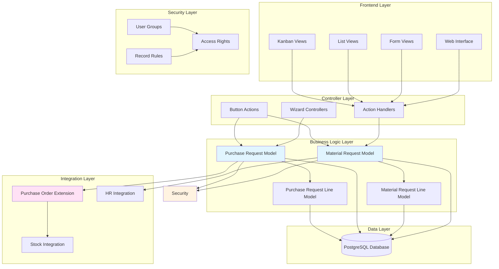
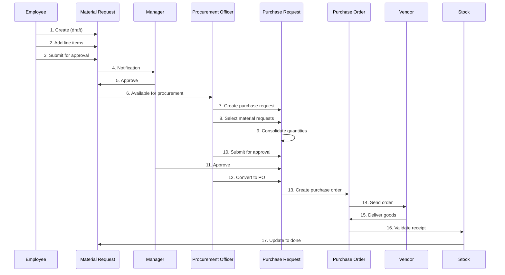
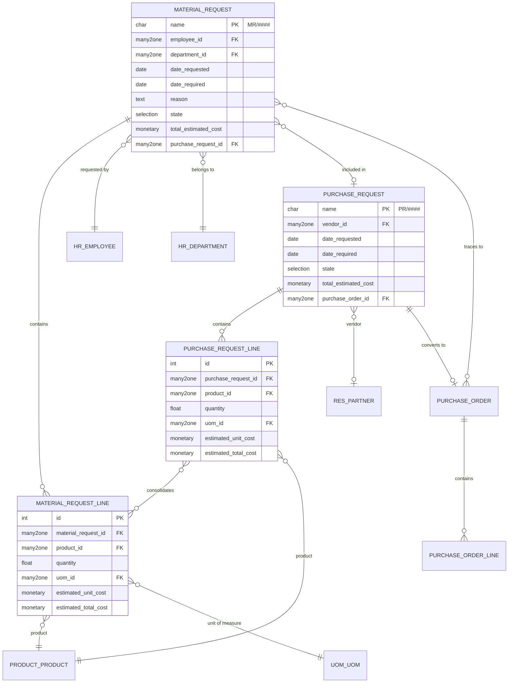
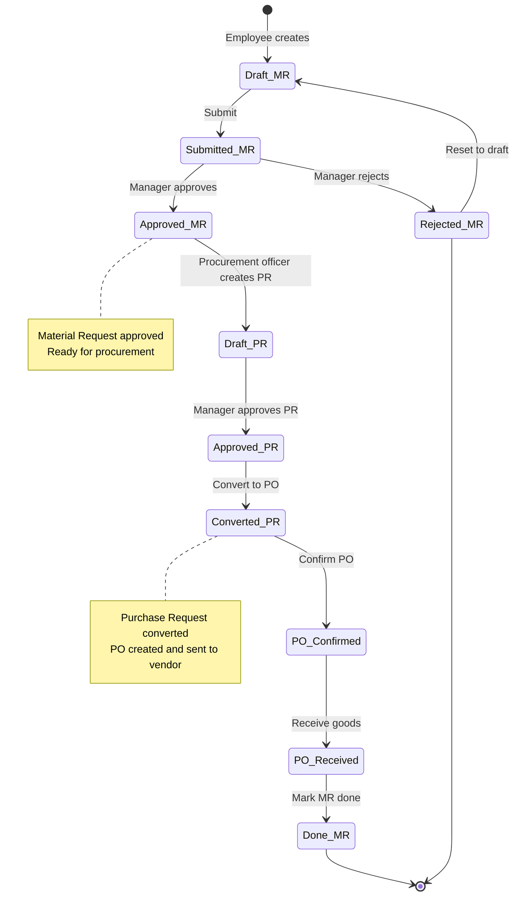

# Odoo Module Design Document - test_app

## Module Overview

**Module Name:** test_app
**Technology Stack:** Python 3.10+ + Odoo 17.0
**Database:** PostgreSQL 12+
**Architecture Pattern:** MVC (Model-View-Controller) + Odoo ORM

## Steering Documents Alignment

### Technical Stack (technical-stack.md)
- **Python Version:** Complies with Python 3.10+ standards
- **Code Style:** Follows PEP 8 and Odoo coding guidelines (OCA standards)
- **Database Design:** Adheres to PostgreSQL best practices with proper indexing
- **ORM Usage:** Leverages Odoo ORM for all database operations (no raw SQL)

### Module Standards (module-standards.md)
- **Module Structure:** Follows standard Odoo 17 module architecture
- **File Naming:** Adheres to Odoo naming conventions (descriptive names, no module prefix in filenames)
- **Version Control:** Follows semantic versioning (1.0.0)
- **Dependencies:** Clear dependency declaration in manifest

### Business Rules (business-rules.md)
- **Workflow:** Implements multi-stage approval workflow (request → approval → procurement → purchase)
- **Access Control:** Role-based access control with four user groups
- **Data Processing:** Complies with data protection regulations via audit trails

## Code Reuse Analysis

### Existing Component Utilization

#### From `purchase` module:
- **purchase.order model:** State management patterns, workflow methods (action_confirm, action_cancel)
- **purchase.order.line model:** Line item patterns with product, quantity, price
- **Sequence generation:** Auto-numbering pattern using ir.sequence
- **Computed fields:** total_amount computation from line items
- **File location:** `odoo/addons/purchase/models/purchase.py`

#### From `purchase_requisition` module:
- **purchase.requisition model:** Multi-request aggregation pattern
- **Conversion logic:** Converting requisition to purchase order
- **Vendor selection:** Vendor relationship and filtering
- **File location:** `odoo/addons/purchase_requisition/models/purchase_requisition.py`

#### From `hr` module:
- **hr.employee model:** Employee data integration
- **hr.department model:** Department-based filtering and grouping
- **Employee context:** Default employee_id from current user
- **File location:** `odoo/addons/hr/models/hr.py`

#### From `mail` module:
- **mail.thread mixin:** Chatter functionality for communication tracking
- **mail.activity.mixin:** Activity scheduling and tracking
- **Notification system:** Automated notifications on state changes
- **File location:** `odoo/addons/mail/models/mail_thread.py`

### Integration Points Analysis

#### Purchase Module Integration
- **Trigger:** Purchase request approval
- **Action:** Create purchase.order record
- **Data Flow:** Purchase request lines → Purchase order lines
- **Linking:** origin field, custom material_request_ids field on purchase.order
- **Pattern:** Extend purchase.order model with _inherit

#### Stock Module Integration
- **Trigger:** Purchase order receipt validated
- **Action:** Update material request state to 'done'
- **Data Flow:** Stock picking → Purchase order → Material requests
- **Linking:** Track via purchase order relationship chain
- **Pattern:** Observe purchase.order write() method or picking validation

#### HR Module Integration
- **Trigger:** Material request creation
- **Action:** Auto-fill employee and department
- **Data Flow:** Current user → hr.employee → material request
- **Linking:** Many2one relationships to hr.employee and hr.department
- **Pattern:** Default value lambda functions

## System Architecture

### Overall Architecture Diagram


### Data Flow Diagram


### Module Structure Design
```
test_app/
├── __init__.py                     # Module initialization
├── __manifest__.py                 # Module manifest with metadata
├── models/
│   ├── __init__.py                 # Import all models
│   ├── material_request.py         # Material request model + line model
│   ├── purchase_request.py         # Purchase request model + line model
│   └── purchase_order.py           # Extend purchase.order for integration
├── views/
│   ├── material_request_views.xml  # Material request form, tree, search, kanban
│   ├── purchase_request_views.xml  # Purchase request form, tree, search
│   └── menus.xml                   # Menu structure
├── security/
│   ├── test_app_security.xml       # User groups and record rules
│   └── ir.model.access.csv         # Model access permissions
├── data/
│   └── sequence.xml                # Sequence definitions for MR/PR numbers
├── wizard/
│   ├── __init__.py
│   ├── material_request_approve_wizard.py    # Bulk approve wizard
│   ├── purchase_request_create_wizard.py     # Create PR from MRs wizard
│   └── purchase_request_convert_wizard.py    # Convert PR to PO wizard
├── report/
│   ├── material_request_report.xml           # PDF report template
│   └── material_request_report_views.xml     # Report action definition
├── tests/
│   ├── __init__.py
│   ├── test_material_request.py    # Material request unit tests
│   ├── test_purchase_request.py    # Purchase request unit tests
│   └── test_integration.py         # Integration tests (MR → PR → PO)
├── demo/
│   └── demo_data.xml               # Demo material requests and purchase requests
└── static/
    └── description/
        ├── icon.png                # Module icon
        └── index.html              # Module description page
```

## Data Model Design

### Model Relationships Diagram


### Material Request Model
```python
# File: test_app/models/material_request.py

from odoo import models, fields, api, _
from odoo.exceptions import UserError, ValidationError


class MaterialRequest(models.Model):
    _name = 'test_app.material.request'
    _description = 'Material Request'
    _inherit = ['mail.thread', 'mail.activity.mixin']
    _order = 'date_requested desc, id desc'

    # Basic Information
    name = fields.Char(
        string='Reference',
        required=True,
        copy=False,
        readonly=True,
        index=True,
        default=lambda self: _('New')
    )

    employee_id = fields.Many2one(
        'hr.employee',
        string='Requested By',
        required=True,
        default=lambda self: self.env.user.employee_id,
        tracking=True,
        index=True
    )

    department_id = fields.Many2one(
        'hr.department',
        string='Department',
        related='employee_id.department_id',
        store=True,
        readonly=True,
        index=True
    )

    # Dates
    date_requested = fields.Date(
        string='Request Date',
        required=True,
        default=fields.Date.today,
        readonly=True,
        tracking=True
    )

    date_required = fields.Date(
        string='Required By Date',
        required=True,
        tracking=True,
        states={'done': [('readonly', True)], 'rejected': [('readonly', True)]}
    )

    reason = fields.Text(
        string='Reason for Request',
        help='Explain why these materials are needed',
        states={'done': [('readonly', True)], 'rejected': [('readonly', True)]}
    )

    # State Management
    state = fields.Selection([
        ('draft', 'Draft'),
        ('submitted', 'Submitted'),
        ('approved', 'Approved'),
        ('rejected', 'Rejected'),
        ('done', 'Done'),
    ], string='Status', default='draft', required=True, tracking=True, index=True)

    # Lines
    line_ids = fields.One2many(
        'test_app.material.request.line',
        'material_request_id',
        string='Request Lines',
        states={'done': [('readonly', True)], 'rejected': [('readonly', True)]}
    )

    # Financial
    total_estimated_cost = fields.Monetary(
        string='Total Estimated Cost',
        compute='_compute_total_estimated_cost',
        store=True,
        currency_field='currency_id'
    )

    currency_id = fields.Many2one(
        'res.currency',
        string='Currency',
        required=True,
        default=lambda self: self.env.company.currency_id
    )

    company_id = fields.Many2one(
        'res.company',
        string='Company',
        required=True,
        default=lambda self: self.env.company
    )

    # Approval Information
    approved_by = fields.Many2one(
        'res.users',
        string='Approved By',
        readonly=True,
        copy=False
    )

    approved_date = fields.Datetime(
        string='Approved Date',
        readonly=True,
        copy=False
    )

    rejected_reason = fields.Text(
        string='Rejection Reason',
        readonly=True,
        copy=False
    )

    # Integration Fields
    purchase_request_id = fields.Many2one(
        'test_app.purchase.request',
        string='Purchase Request',
        readonly=True,
        copy=False,
        index=True
    )

    purchase_order_id = fields.Many2one(
        'purchase.order',
        string='Purchase Order',
        related='purchase_request_id.purchase_order_id',
        store=True,
        readonly=True
    )

    # Computed Fields
    line_count = fields.Integer(
        string='Line Count',
        compute='_compute_line_count'
    )

    # Compute Methods
    @api.depends('line_ids.estimated_total_cost')
    def _compute_total_estimated_cost(self):
        for request in self:
            request.total_estimated_cost = sum(request.line_ids.mapped('estimated_total_cost'))

    @api.depends('line_ids')
    def _compute_line_count(self):
        for request in self:
            request.line_count = len(request.line_ids)

    # CRUD Methods
    @api.model_create_multi
    def create(self, vals_list):
        for vals in vals_list:
            if vals.get('name', _('New')) == _('New'):
                vals['name'] = self.env['ir.sequence'].next_by_code('test_app.material.request') or _('New')
        return super().create(vals_list)

    # Constraints
    @api.constrains('line_ids')
    def _check_lines(self):
        for request in self:
            if request.state not in ('draft', 'rejected') and not request.line_ids:
                raise ValidationError(_('Material request must have at least one line item.'))

    @api.constrains('date_required')
    def _check_date_required(self):
        for request in self:
            if request.date_required and request.date_required < request.date_requested:
                raise ValidationError(_('Required date cannot be before request date.'))

    # Business Logic Methods
    def action_submit(self):
        """Submit material request for approval"""
        self.ensure_one()
        if not self.line_ids:
            raise UserError(_('Cannot submit a material request without line items.'))

        self.write({'state': 'submitted'})

        # Send notification to managers
        self._notify_managers('submitted')

        return True

    def action_approve(self):
        """Approve material request"""
        self.ensure_one()
        if self.state != 'submitted':
            raise UserError(_('Only submitted requests can be approved.'))

        self.write({
            'state': 'approved',
            'approved_by': self.env.user.id,
            'approved_date': fields.Datetime.now(),
        })

        # Notify requester
        self.message_post(
            body=_('Material request approved by %s') % self.env.user.name,
            message_type='notification'
        )

        return True

    def action_reject(self):
        """Open wizard to reject with reason"""
        self.ensure_one()
        return {
            'name': _('Reject Material Request'),
            'type': 'ir.actions.act_window',
            'res_model': 'test_app.material.request.reject.wizard',
            'view_mode': 'form',
            'target': 'new',
            'context': {'default_material_request_id': self.id}
        }

    def action_set_to_draft(self):
        """Reset to draft state"""
        self.ensure_one()
        if self.state == 'done':
            raise UserError(_('Cannot reset a completed material request to draft.'))

        self.write({
            'state': 'draft',
            'approved_by': False,
            'approved_date': False,
            'rejected_reason': False,
        })

        return True

    def action_mark_done(self):
        """Mark material request as done (fulfilled)"""
        self.write({'state': 'done'})
        return True

    def _notify_managers(self, event):
        """Send notification to managers based on event"""
        # Get users in manager group
        manager_group = self.env.ref('test_app.group_material_request_manager')
        managers = manager_group.users

        if event == 'submitted':
            subject = _('Material Request Submitted: %s') % self.name
            body = _(
                'Material request %s has been submitted by %s and requires approval.\n'
                'Department: %s\n'
                'Required By: %s\n'
                'Estimated Cost: %s %s'
            ) % (
                self.name,
                self.employee_id.name,
                self.department_id.name or 'N/A',
                self.date_required,
                self.total_estimated_cost,
                self.currency_id.name
            )

            for manager in managers:
                self.message_post(
                    body=body,
                    subject=subject,
                    partner_ids=[manager.partner_id.id],
                    message_type='notification'
                )

    # View Actions
    def action_view_purchase_request(self):
        """Open related purchase request"""
        self.ensure_one()
        return {
            'name': _('Purchase Request'),
            'type': 'ir.actions.act_window',
            'res_model': 'test_app.purchase.request',
            'view_mode': 'form',
            'res_id': self.purchase_request_id.id,
            'target': 'current',
        }

    def action_view_purchase_order(self):
        """Open related purchase order"""
        self.ensure_one()
        return {
            'name': _('Purchase Order'),
            'type': 'ir.actions.act_window',
            'res_model': 'purchase.order',
            'view_mode': 'form',
            'res_id': self.purchase_order_id.id,
            'target': 'current',
        }


class MaterialRequestLine(models.Model):
    _name = 'test_app.material.request.line'
    _description = 'Material Request Line'
    _order = 'sequence, id'

    sequence = fields.Integer(string='Sequence', default=10)

    material_request_id = fields.Many2one(
        'test_app.material.request',
        string='Material Request',
        required=True,
        ondelete='cascade',
        index=True
    )

    product_id = fields.Many2one(
        'product.product',
        string='Product',
        required=True,
        domain=[('purchase_ok', '=', True)]
    )

    description = fields.Text(
        string='Description',
        help='Additional notes or specifications for this product'
    )

    quantity = fields.Float(
        string='Quantity',
        required=True,
        default=1.0,
        digits='Product Unit of Measure'
    )

    uom_id = fields.Many2one(
        'uom.uom',
        string='Unit of Measure',
        required=True
    )

    estimated_unit_cost = fields.Monetary(
        string='Estimated Unit Cost',
        currency_field='currency_id'
    )

    estimated_total_cost = fields.Monetary(
        string='Estimated Total',
        compute='_compute_estimated_total_cost',
        store=True,
        currency_field='currency_id'
    )

    currency_id = fields.Many2one(
        related='material_request_id.currency_id',
        store=True,
        readonly=True
    )

    state = fields.Selection(
        related='material_request_id.state',
        store=True,
        readonly=True
    )

    purchase_request_line_id = fields.Many2one(
        'test_app.purchase.request.line',
        string='Purchase Request Line',
        readonly=True,
        copy=False
    )

    # Compute Methods
    @api.depends('quantity', 'estimated_unit_cost')
    def _compute_estimated_total_cost(self):
        for line in self:
            line.estimated_total_cost = line.quantity * line.estimated_unit_cost

    # Onchange Methods
    @api.onchange('product_id')
    def _onchange_product_id(self):
        if self.product_id:
            self.uom_id = self.product_id.uom_po_id
            self.description = self.product_id.display_name
            # Optionally set estimated unit cost from product
            if self.product_id.standard_price:
                self.estimated_unit_cost = self.product_id.standard_price

    # Constraints
    @api.constrains('quantity')
    def _check_quantity(self):
        for line in self:
            if line.quantity <= 0:
                raise ValidationError(_('Quantity must be greater than zero.'))

    @api.constrains('estimated_unit_cost')
    def _check_estimated_cost(self):
        for line in self:
            if line.estimated_unit_cost < 0:
                raise ValidationError(_('Estimated unit cost cannot be negative.'))
```

### Purchase Request Model
```python
# File: test_app/models/purchase_request.py

from odoo import models, fields, api, _
from odoo.exceptions import UserError, ValidationError


class PurchaseRequest(models.Model):
    _name = 'test_app.purchase.request'
    _description = 'Purchase Request'
    _inherit = ['mail.thread', 'mail.activity.mixin']
    _order = 'date_requested desc, id desc'

    # Basic Information
    name = fields.Char(
        string='Reference',
        required=True,
        copy=False,
        readonly=True,
        index=True,
        default=lambda self: _('New')
    )

    vendor_id = fields.Many2one(
        'res.partner',
        string='Vendor',
        domain=[('is_company', '=', True), ('supplier_rank', '>', 0)],
        tracking=True
    )

    # Dates
    date_requested = fields.Date(
        string='Request Date',
        required=True,
        default=fields.Date.today,
        readonly=True
    )

    date_required = fields.Date(
        string='Required By Date',
        compute='_compute_date_required',
        store=True,
        readonly=False
    )

    notes = fields.Text(
        string='Notes',
        help='Additional procurement notes'
    )

    # State Management
    state = fields.Selection([
        ('draft', 'Draft'),
        ('approved', 'Approved'),
        ('converted', 'Converted to PO'),
        ('cancelled', 'Cancelled'),
    ], string='Status', default='draft', required=True, tracking=True, index=True)

    # Material Requests
    material_request_ids = fields.One2many(
        'test_app.material.request',
        'purchase_request_id',
        string='Material Requests',
        readonly=True
    )

    # Lines
    line_ids = fields.One2many(
        'test_app.purchase.request.line',
        'purchase_request_id',
        string='Purchase Request Lines'
    )

    # Financial
    total_estimated_cost = fields.Monetary(
        string='Total Estimated Cost',
        compute='_compute_total_estimated_cost',
        store=True,
        currency_field='currency_id'
    )

    currency_id = fields.Many2one(
        'res.currency',
        string='Currency',
        required=True,
        default=lambda self: self.env.company.currency_id
    )

    company_id = fields.Many2one(
        'res.company',
        string='Company',
        required=True,
        default=lambda self: self.env.company
    )

    # User Tracking
    created_by = fields.Many2one(
        'res.users',
        string='Created By',
        default=lambda self: self.env.user,
        readonly=True
    )

    approved_by = fields.Many2one(
        'res.users',
        string='Approved By',
        readonly=True
    )

    approved_date = fields.Datetime(
        string='Approved Date',
        readonly=True
    )

    # Integration
    purchase_order_id = fields.Many2one(
        'purchase.order',
        string='Purchase Order',
        readonly=True,
        copy=False,
        index=True
    )

    # Computed Fields
    material_request_count = fields.Integer(
        string='Material Request Count',
        compute='_compute_material_request_count'
    )

    line_count = fields.Integer(
        string='Line Count',
        compute='_compute_line_count'
    )

    # Compute Methods
    @api.depends('material_request_ids')
    def _compute_date_required(self):
        for request in self:
            if request.material_request_ids:
                request.date_required = min(request.material_request_ids.mapped('date_required'))
            else:
                request.date_required = fields.Date.today()

    @api.depends('line_ids.estimated_total_cost')
    def _compute_total_estimated_cost(self):
        for request in self:
            request.total_estimated_cost = sum(request.line_ids.mapped('estimated_total_cost'))

    @api.depends('material_request_ids')
    def _compute_material_request_count(self):
        for request in self:
            request.material_request_count = len(request.material_request_ids)

    @api.depends('line_ids')
    def _compute_line_count(self):
        for request in self:
            request.line_count = len(request.line_ids)

    # CRUD Methods
    @api.model_create_multi
    def create(self, vals_list):
        for vals in vals_list:
            if vals.get('name', _('New')) == _('New'):
                vals['name'] = self.env['ir.sequence'].next_by_code('test_app.purchase.request') or _('New')
        return super().create(vals_list)

    # Business Logic Methods
    def action_approve(self):
        """Approve purchase request"""
        self.ensure_one()
        if self.state != 'draft':
            raise UserError(_('Only draft purchase requests can be approved.'))

        if not self.line_ids:
            raise UserError(_('Cannot approve purchase request without lines.'))

        self.write({
            'state': 'approved',
            'approved_by': self.env.user.id,
            'approved_date': fields.Datetime.now(),
        })

        return True

    def action_convert_to_po(self):
        """Convert purchase request to purchase order"""
        self.ensure_one()

        if self.state != 'approved':
            raise UserError(_('Only approved purchase requests can be converted to purchase orders.'))

        if not self.vendor_id:
            # Open wizard to select vendor
            return {
                'name': _('Select Vendor'),
                'type': 'ir.actions.act_window',
                'res_model': 'test_app.purchase.request.convert.wizard',
                'view_mode': 'form',
                'target': 'new',
                'context': {'default_purchase_request_id': self.id}
            }

        # Create purchase order
        po_vals = self._prepare_purchase_order_values()
        purchase_order = self.env['purchase.order'].create(po_vals)

        # Create purchase order lines
        for line in self.line_ids:
            po_line_vals = line._prepare_purchase_order_line_values(purchase_order.id)
            po_line = self.env['purchase.order.line'].create(po_line_vals)
            line.write({'purchase_order_line_id': po_line.id})

        # Update purchase request state
        self.write({
            'state': 'converted',
            'purchase_order_id': purchase_order.id,
        })

        # Open the created purchase order
        return {
            'name': _('Purchase Order'),
            'type': 'ir.actions.act_window',
            'res_model': 'purchase.order',
            'view_mode': 'form',
            'res_id': purchase_order.id,
            'target': 'current',
        }

    def _prepare_purchase_order_values(self):
        """Prepare values for creating purchase order"""
        self.ensure_one()
        return {
            'partner_id': self.vendor_id.id,
            'date_order': fields.Datetime.now(),
            'date_planned': self.date_required,
            'origin': self.name,
            'company_id': self.company_id.id,
            'currency_id': self.currency_id.id,
            'material_request_ids': [(6, 0, self.material_request_ids.ids)],
        }

    def action_cancel(self):
        """Cancel purchase request"""
        self.ensure_one()
        if self.state == 'converted':
            raise UserError(_('Cannot cancel a purchase request that has been converted to a purchase order.'))

        self.write({'state': 'cancelled'})

        # Unlink material requests to allow reassignment
        self.material_request_ids.write({'purchase_request_id': False})

        return True

    def action_set_to_draft(self):
        """Reset to draft"""
        self.write({'state': 'draft'})
        return True

    # View Actions
    def action_view_material_requests(self):
        """View all related material requests"""
        self.ensure_one()
        return {
            'name': _('Material Requests'),
            'type': 'ir.actions.act_window',
            'res_model': 'test_app.material.request',
            'view_mode': 'tree,form',
            'domain': [('id', 'in', self.material_request_ids.ids)],
            'context': {'default_purchase_request_id': self.id},
        }

    def action_view_purchase_order(self):
        """View related purchase order"""
        self.ensure_one()
        return {
            'name': _('Purchase Order'),
            'type': 'ir.actions.act_window',
            'res_model': 'purchase.order',
            'view_mode': 'form',
            'res_id': self.purchase_order_id.id,
        }


class PurchaseRequestLine(models.Model):
    _name = 'test_app.purchase.request.line'
    _description = 'Purchase Request Line'
    _order = 'sequence, id'

    sequence = fields.Integer(string='Sequence', default=10)

    purchase_request_id = fields.Many2one(
        'test_app.purchase.request',
        string='Purchase Request',
        required=True,
        ondelete='cascade',
        index=True
    )

    product_id = fields.Many2one(
        'product.product',
        string='Product',
        required=True
    )

    description = fields.Text(string='Description')

    quantity = fields.Float(
        string='Quantity',
        required=True,
        digits='Product Unit of Measure'
    )

    uom_id = fields.Many2one(
        'uom.uom',
        string='Unit of Measure',
        required=True
    )

    estimated_unit_cost = fields.Monetary(
        string='Estimated Unit Cost',
        currency_field='currency_id'
    )

    estimated_total_cost = fields.Monetary(
        string='Estimated Total',
        compute='_compute_estimated_total_cost',
        store=True,
        currency_field='currency_id'
    )

    currency_id = fields.Many2one(
        related='purchase_request_id.currency_id',
        store=True,
        readonly=True
    )

    material_request_line_ids = fields.Many2many(
        'test_app.material.request.line',
        'purchase_request_line_material_request_line_rel',
        'purchase_request_line_id',
        'material_request_line_id',
        string='Source Material Request Lines',
        readonly=True
    )

    purchase_order_line_id = fields.Many2one(
        'purchase.order.line',
        string='Purchase Order Line',
        readonly=True,
        copy=False
    )

    # Compute Methods
    @api.depends('quantity', 'estimated_unit_cost')
    def _compute_estimated_total_cost(self):
        for line in self:
            line.estimated_total_cost = line.quantity * line.estimated_unit_cost

    # Preparation Methods
    def _prepare_purchase_order_line_values(self, purchase_order_id):
        """Prepare values for creating purchase order line"""
        self.ensure_one()
        return {
            'order_id': purchase_order_id,
            'product_id': self.product_id.id,
            'name': self.description or self.product_id.display_name,
            'product_qty': self.quantity,
            'product_uom': self.uom_id.id,
            'price_unit': self.estimated_unit_cost,
            'date_planned': self.purchase_request_id.date_required,
        }

    # Constraints
    @api.constrains('quantity')
    def _check_quantity(self):
        for line in self:
            if line.quantity <= 0:
                raise ValidationError(_('Quantity must be greater than zero.'))
```

### Purchase Order Extension
```python
# File: test_app/models/purchase_order.py

from odoo import models, fields, api


class PurchaseOrder(models.Model):
    _inherit = 'purchase.order'

    material_request_ids = fields.Many2many(
        'test_app.material.request',
        'purchase_order_material_request_rel',
        'purchase_order_id',
        'material_request_id',
        string='Material Requests',
        readonly=True,
        help='Material requests that are fulfilled by this purchase order'
    )

    material_request_count = fields.Integer(
        string='Material Request Count',
        compute='_compute_material_request_count'
    )

    @api.depends('material_request_ids')
    def _compute_material_request_count(self):
        for order in self:
            order.material_request_count = len(order.material_request_ids)

    def action_view_material_requests(self):
        """View all related material requests"""
        self.ensure_one()
        return {
            'name': _('Material Requests'),
            'type': 'ir.actions.act_window',
            'res_model': 'test_app.material.request',
            'view_mode': 'tree,form',
            'domain': [('id', 'in', self.material_request_ids.ids)],
        }

    def button_confirm(self):
        """Override to update material requests when PO is confirmed"""
        result = super().button_confirm()
        # Material requests remain in approved state until delivery
        return result


class StockPicking(models.Model):
    _inherit = 'stock.picking'

    def button_validate(self):
        """Override to mark material requests as done when delivery is validated"""
        result = super().button_validate()

        # Find material requests linked to this picking's purchase order
        for picking in self:
            if picking.purchase_id and picking.purchase_id.material_request_ids:
                # Mark material requests as done
                material_requests = picking.purchase_id.material_request_ids.filtered(
                    lambda mr: mr.state == 'approved'
                )
                material_requests.action_mark_done()

        return result
```

## User Interface Design

### View Architecture Summary

#### Material Request Views
1. **Form View** - Main data entry form with header buttons (Submit, Approve, Reject)
2. **Tree View** - List of material requests with key columns
3. **Kanban View** - Card view grouped by state for visual workflow
4. **Search View** - Filters by state, department, employee, date
5. **Pivot View** - Analysis by department, product, time period

#### Purchase Request Views
1. **Form View** - Purchase request creation with material request selection
2. **Tree View** - List of purchase requests
3. **Search View** - Filters by state, vendor, date

### Form View Example (Material Request)
```xml
<!-- File: test_app/views/material_request_views.xml -->

<record id="view_material_request_form" model="ir.ui.view">
    <field name="name">test_app.material.request.form</field>
    <field name="model">test_app.material.request</field>
    <field name="arch" type="xml">
        <form string="Material Request">
            <header>
                <button name="action_submit" type="object" string="Submit for Approval"
                        class="btn-primary"
                        attrs="{'invisible': [('state', '!=', 'draft')]}"/>
                <button name="action_approve" type="object" string="Approve"
                        class="btn-success"
                        groups="test_app.group_material_request_manager"
                        attrs="{'invisible': [('state', '!=', 'submitted')]}"/>
                <button name="action_reject" type="object" string="Reject"
                        class="btn-danger"
                        groups="test_app.group_material_request_manager"
                        attrs="{'invisible': [('state', 'not in', ['submitted', 'approved'])]}"/>
                <button name="action_set_to_draft" type="object" string="Set to Draft"
                        groups="test_app.group_material_request_manager"
                        attrs="{'invisible': [('state', 'in', ['draft', 'done'])]}"/>
                <field name="state" widget="statusbar"
                       statusbar_visible="draft,submitted,approved,done"/>
            </header>
            <sheet>
                <div class="oe_button_box" name="button_box">
                    <button name="action_view_purchase_request" type="object"
                            class="oe_stat_button" icon="fa-shopping-cart"
                            attrs="{'invisible': [('purchase_request_id', '=', False)]}">
                        <div class="o_field_widget o_stat_info">
                            <span class="o_stat_text">Purchase Request</span>
                        </div>
                    </button>
                    <button name="action_view_purchase_order" type="object"
                            class="oe_stat_button" icon="fa-truck"
                            attrs="{'invisible': [('purchase_order_id', '=', False)]}">
                        <div class="o_field_widget o_stat_info">
                            <span class="o_stat_text">Purchase Order</span>
                        </div>
                    </button>
                </div>

                <div class="oe_title">
                    <h1>
                        <field name="name" readonly="1"/>
                    </h1>
                </div>

                <group>
                    <group>
                        <field name="employee_id" options="{'no_create': True}"/>
                        <field name="department_id"/>
                        <field name="date_requested"/>
                    </group>
                    <group>
                        <field name="date_required"/>
                        <field name="total_estimated_cost" widget="monetary"/>
                        <field name="currency_id" invisible="1"/>
                        <field name="company_id" groups="base.group_multi_company"/>
                    </group>
                </group>

                <group string="Approval Information"
                       attrs="{'invisible': [('state', 'in', ['draft', 'submitted'])]}">
                    <group>
                        <field name="approved_by" attrs="{'invisible': [('state', '!=', 'approved')]}"/>
                        <field name="approved_date" attrs="{'invisible': [('state', '!=', 'approved')]}"/>
                    </group>
                    <group>
                        <field name="rejected_reason" attrs="{'invisible': [('state', '!=', 'rejected')]}"/>
                    </group>
                </group>

                <notebook>
                    <page string="Request Lines">
                        <field name="line_ids">
                            <tree editable="bottom">
                                <field name="sequence" widget="handle"/>
                                <field name="product_id" options="{'no_create': True}"/>
                                <field name="description"/>
                                <field name="quantity"/>
                                <field name="uom_id" groups="uom.group_uom"/>
                                <field name="estimated_unit_cost" widget="monetary"/>
                                <field name="estimated_total_cost" widget="monetary" sum="Total"/>
                                <field name="currency_id" invisible="1"/>
                            </tree>
                        </field>
                    </page>
                    <page string="Other Information">
                        <group>
                            <field name="reason" nolabel="1" placeholder="Explain why these materials are needed..."/>
                        </group>
                    </page>
                </notebook>
            </sheet>
            <div class="oe_chatter">
                <field name="message_follower_ids"/>
                <field name="activity_ids"/>
                <field name="message_ids"/>
            </div>
        </form>
    </field>
</record>
```

## Security Model

### User Groups Hierarchy
```xml
<!-- File: test_app/security/test_app_security.xml -->

<odoo>
    <data noupdate="0">

        <!-- Category -->
        <record id="module_category_material_request" model="ir.module.category">
            <field name="name">Material Request</field>
            <field name="description">Manage material request permissions</field>
            <field name="sequence">10</field>
        </record>

        <!-- Material Request User -->
        <record id="group_material_request_user" model="res.groups">
            <field name="name">User: Material Request</field>
            <field name="category_id" ref="module_category_material_request"/>
            <field name="implied_ids" eval="[(4, ref('base.group_user'))]"/>
            <field name="comment">User can create and manage own material requests</field>
        </record>

        <!-- Material Request Manager -->
        <record id="group_material_request_manager" model="res.groups">
            <field name="name">Manager: Material Request</field>
            <field name="category_id" ref="module_category_material_request"/>
            <field name="implied_ids" eval="[(4, ref('group_material_request_user'))]"/>
            <field name="comment">Manager can approve/reject material requests</field>
        </record>

        <!-- Procurement Officer -->
        <record id="group_procurement_officer" model="res.groups">
            <field name="name">Officer: Procurement</field>
            <field name="category_id" ref="module_category_material_request"/>
            <field name="implied_ids" eval="[(4, ref('group_material_request_manager')), (4, ref('purchase.group_purchase_user'))]"/>
            <field name="comment">Procurement officer can create purchase requests</field>
        </record>

        <!-- Procurement Manager -->
        <record id="group_procurement_manager" model="res.groups">
            <field name="name">Manager: Procurement</field>
            <field name="category_id" ref="module_category_material_request"/>
            <field name="implied_ids" eval="[(4, ref('group_procurement_officer')), (4, ref('purchase.group_purchase_manager'))]"/>
            <field name="comment">Full access to all procurement and material request functions</field>
        </record>

        <!-- Record Rules -->

        <!-- Material Request: Multi-company Rule -->
        <record id="material_request_comp_rule" model="ir.rule">
            <field name="name">Material Request: Multi-company</field>
            <field name="model_id" ref="model_test_app_material_request"/>
            <field name="global" eval="True"/>
            <field name="domain_force">['|', ('company_id', '=', False), ('company_id', 'in', company_ids)]</field>
        </record>

        <!-- Material Request: User can see own and approved requests -->
        <record id="material_request_user_rule" model="ir.rule">
            <field name="name">Material Request: User Access</field>
            <field name="model_id" ref="model_test_app_material_request"/>
            <field name="domain_force">['|', ('employee_id.user_id', '=', user.id), ('state', 'in', ['approved', 'rejected', 'done'])]</field>
            <field name="groups" eval="[(4, ref('group_material_request_user'))]"/>
        </record>

        <!-- Material Request: Managers see all -->
        <record id="material_request_manager_rule" model="ir.rule">
            <field name="name">Material Request: Manager Access</field>
            <field name="model_id" ref="model_test_app_material_request"/>
            <field name="domain_force">[(1, '=', 1)]</field>
            <field name="groups" eval="[(4, ref('group_material_request_manager'))]"/>
        </record>

        <!-- Purchase Request: Multi-company Rule -->
        <record id="purchase_request_comp_rule" model="ir.rule">
            <field name="name">Purchase Request: Multi-company</field>
            <field name="model_id" ref="model_test_app_purchase_request"/>
            <field name="global" eval="True"/>
            <field name="domain_force">['|', ('company_id', '=', False), ('company_id', 'in', company_ids)]</field>
        </record>

    </data>
</odoo>
```

### Access Rights Matrix
```csv
id,name,model_id:id,group_id:id,perm_read,perm_write,perm_create,perm_unlink
access_material_request_user,access_material_request_user,model_test_app_material_request,group_material_request_user,1,1,1,0
access_material_request_manager,access_material_request_manager,model_test_app_material_request,group_material_request_manager,1,1,1,1
access_material_request_line_user,access_material_request_line_user,model_test_app_material_request_line,group_material_request_user,1,1,1,1
access_purchase_request_officer,access_purchase_request_officer,model_test_app_purchase_request,group_procurement_officer,1,1,1,1
access_purchase_request_line_officer,access_purchase_request_line_officer,model_test_app_purchase_request_line,group_procurement_officer,1,1,1,1
```

## Workflow Design

### State Transition Diagram



## Integration Specifications

### Purchase Module Integration Flow

```python
# Workflow: Purchase Request → Purchase Order

def action_convert_to_po(self):
    # 1. Create purchase order header
    po = self.env['purchase.order'].create({
        'partner_id': self.vendor_id.id,
        'origin': self.name,
        'material_request_ids': [(6, 0, self.material_request_ids.ids)]
    })

    # 2. Create purchase order lines from purchase request lines
    for pr_line in self.line_ids:
        po_line = self.env['purchase.order.line'].create({
            'order_id': po.id,
            'product_id': pr_line.product_id.id,
            'product_qty': pr_line.quantity,
            'price_unit': pr_line.estimated_unit_cost
        })
        pr_line.purchase_order_line_id = po_line.id

    # 3. Update purchase request state
    self.state = 'converted'
    self.purchase_order_id = po.id

    return po
```

## Performance Considerations

### Database Optimization
- **Indexes:** name, state, employee_id, department_id, date_requested, date_required
- **Stored Computed Fields:** total_estimated_cost, department_id, state (on lines)
- **Efficient Queries:** Use `search_read()` for list views with specific field sets

### Caching Strategy
- Product data cached via Odoo ORM
- Employee and department data cached
- Currency rates cached by Odoo accounting

## Testing Strategy

### Unit Test Coverage
```python
# File: test_app/tests/test_material_request.py

from odoo.tests.common import TransactionCase
from odoo.exceptions import ValidationError, UserError


class TestMaterialRequest(TransactionCase):

    def setUp(self):
        super().setUp()
        self.MaterialRequest = self.env['test_app.material.request']
        self.employee = self.env.ref('hr.employee_admin')
        self.product = self.env.ref('product.product_product_9')

    def test_create_material_request(self):
        """Test material request creation with auto-sequence"""
        mr = self.MaterialRequest.create({
            'employee_id': self.employee.id,
            'date_required': '2026-03-01',
        })
        self.assertTrue(mr.name)
        self.assertNotEqual(mr.name, 'New')
        self.assertEqual(mr.state, 'draft')

    def test_submit_without_lines_fails(self):
        """Test that submitting without lines raises error"""
        mr = self.MaterialRequest.create({
            'employee_id': self.employee.id,
            'date_required': '2026-03-01',
        })
        with self.assertRaises(UserError):
            mr.action_submit()

    def test_approve_workflow(self):
        """Test complete approval workflow"""
        mr = self.MaterialRequest.create({
            'employee_id': self.employee.id,
            'date_required': '2026-03-01',
            'line_ids': [(0, 0, {
                'product_id': self.product.id,
                'quantity': 5,
                'uom_id': self.product.uom_id.id,
                'estimated_unit_cost': 100,
            })]
        })

        # Submit
        mr.action_submit()
        self.assertEqual(mr.state, 'submitted')

        # Approve
        mr.action_approve()
        self.assertEqual(mr.state, 'approved')
        self.assertTrue(mr.approved_by)
        self.assertTrue(mr.approved_date)
```

## Deployment Checklist

### Pre-deployment Validation
- [ ] All unit tests passing (80%+ coverage)
- [ ] Security permissions configured and tested
- [ ] Demo data loads correctly
- [ ] Performance benchmarks met (list views < 1s, forms < 2s)
- [ ] Code review completed
- [ ] Documentation complete

### Post-deployment Monitoring
- [ ] Error logging configured and monitored
- [ ] Performance monitoring active (slow queries alert)
- [ ] User feedback collection process
- [ ] System health checks scheduled

---

**Last Updated:** 2026-02-16
**Document Version:** 1.0
**Approval Status:** Pending
